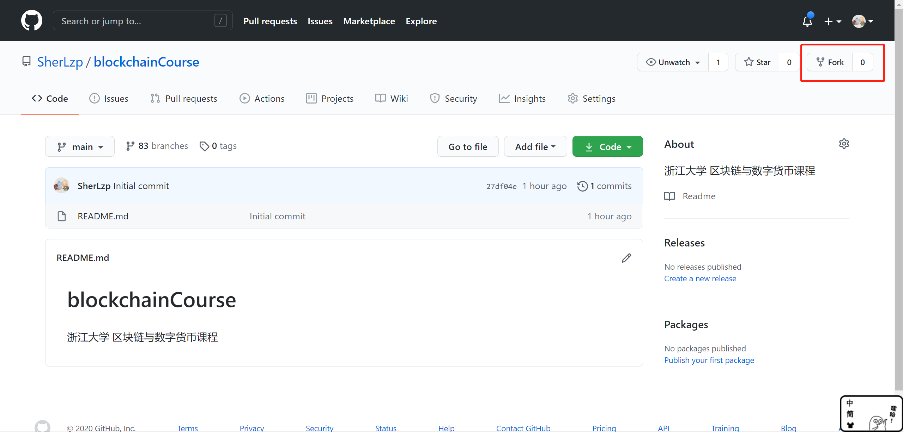
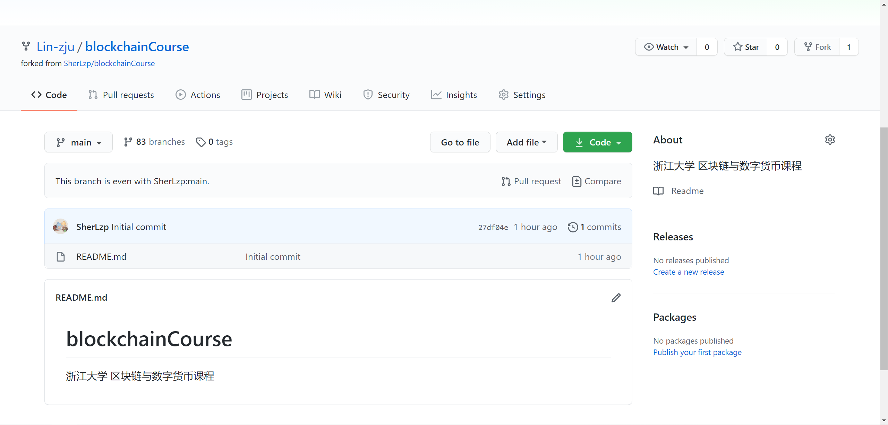
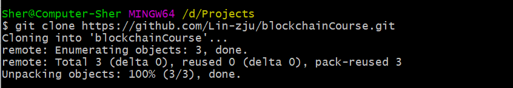
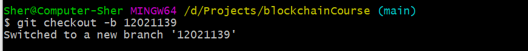
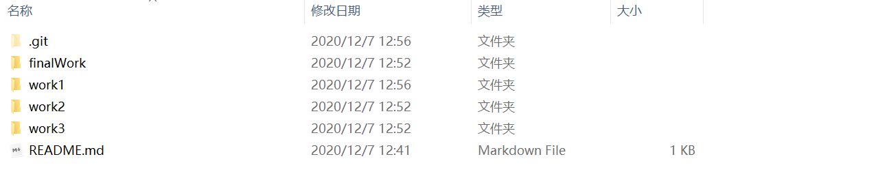
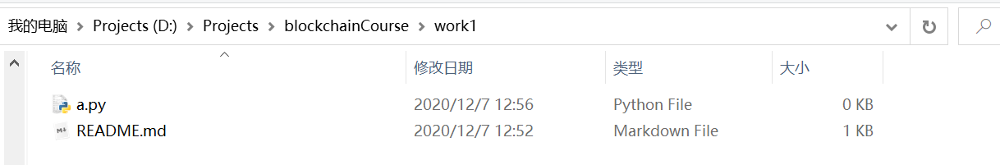
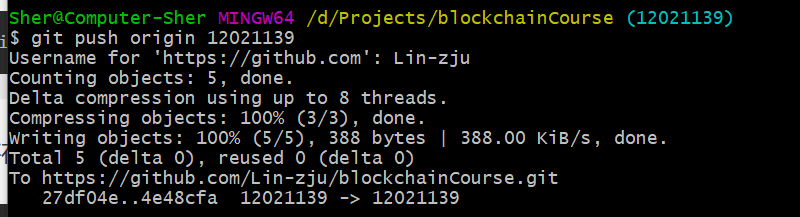
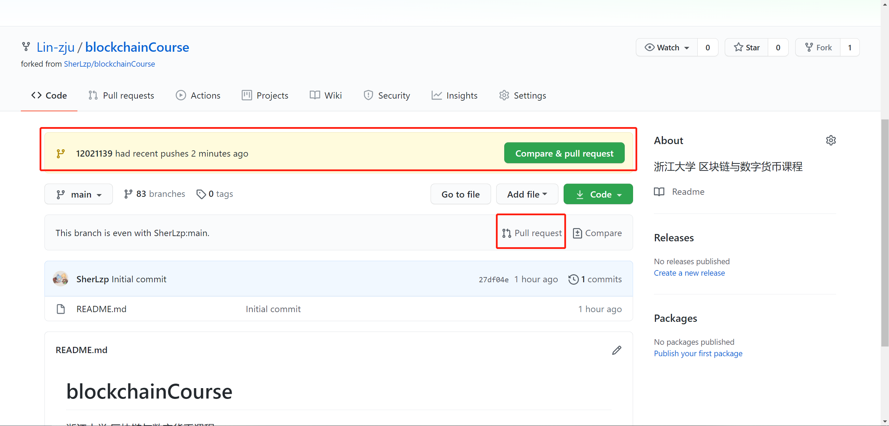
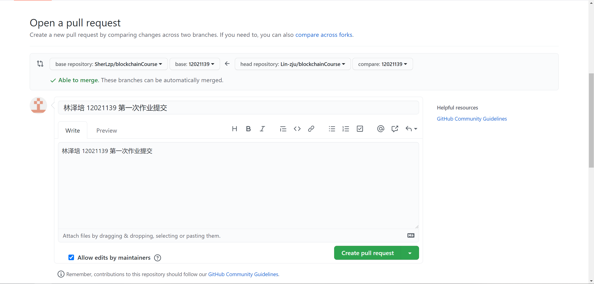
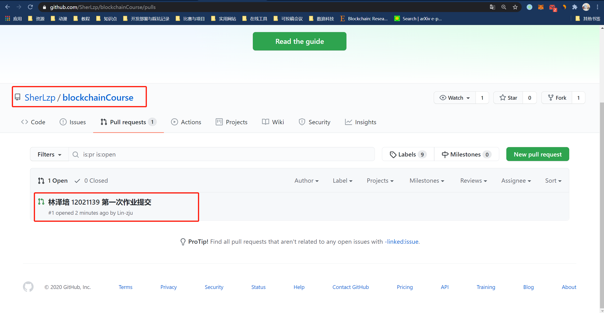

# 浙江大学 区块链与数字货币课程
教师：杨小虎

助教：林泽培

**【注】如有任何问题请在钉钉上联系我（林泽培），或在群里进行提问。**

**【注】为了避免抄袭，作业文字内容请单独发我邮箱（lzp.sher@gmail.com或者sherlin@zju.edu.cn）。**

## 作业内容【持续更新】

### 课程作业1

- SHA256实现
- 设计实验说明SHA256如何用于区块数据锁定
- 设计实验说明SHA256在PoW中的作用

### 课程作业2

### 课程作业3

### 大作业

## 作业提交说明

为了保证代码的可运行性，我们的课程采用github仓库的方式来进行维护，麻烦各位同学按照以下规则来提交作业。

**【注】请勿修改根目录下README.md**

首先，本课程一共81位同学。每位同学按照各位的学号有一个自己的分支，我们采用Fork + PR的方式来进行作业提交与代码管理。每位同学将会维护自己的分支，PR也是PR到自己学号的分支上，然后由我来进行合并到主分支。

创建文件夹规则为：

```shell
├─linzepei
    ├─finalWork #最后的大作业
    ├─work1 #第一次作业
    ├─work2 #第二次作业
    └─work3 #第三次作业
```

作业内容：

**请各位同学将每次作业的作业内容和源码都放在对应的文件夹下，内容需要新建README.md来进行详细说明【可参考例子】，README中写明如何运行你的代码并给出几个相应的运行测试结果【注：需要确保代码可运行】，同时写代码时注意考虑边界条件。**

如第一次作业就放在`work1`文件夹下，并新建`README.md`然后进行文字内容的完成，同时把第一次作业的源码也提交在`work1`目录下。

### 提交演示

下面将以我的学号为例为大家演示如何进行作业提交：

1. 首先fork项目：https://github.com/SherLzp/blockchainCourse



2. Fork之后回到自己的仓库目录下，clone项目，此处Lin-zju是我新建的账号：

```shell
$ git clone https://github.com/[你的账号名]/blockchainCourse.git
```





3. 切换到自己的分支上【学号】，此处我的学号为12021139：

```shell
$ git checkout -b [你的学号]
```



4. 然后新建每次作业目录，先创建你的名字的文件夹，如`linzepei`，然后按照`work1`/`work2`/`work3`/`finalWork`的方式进行创建：



5. 然后在每次需要提交的作业下修改`README.md`来完成文字内容【没有则进行创建】，如：




6. 将完成的作业内容add并commit并push到自己的分支后，可以在网页上进行Pull Request（PR）：





请注意在PR的说明里附上自己的学号与姓名，注意PR的分支一定要提交到自己学号对应的分支上。

**【注】如果PR后需要修改代码，可直接在自己本地的对应的分支上进行修改提交即可，PR绑定的是你自己库上对应的分支。我会在截止时间当天晚上进行review与合并，如需修改请在那之前。**



此外，大家可以在原始库里看到自己的PR提交：



**【注】例子可以参考`12021139`分支。**